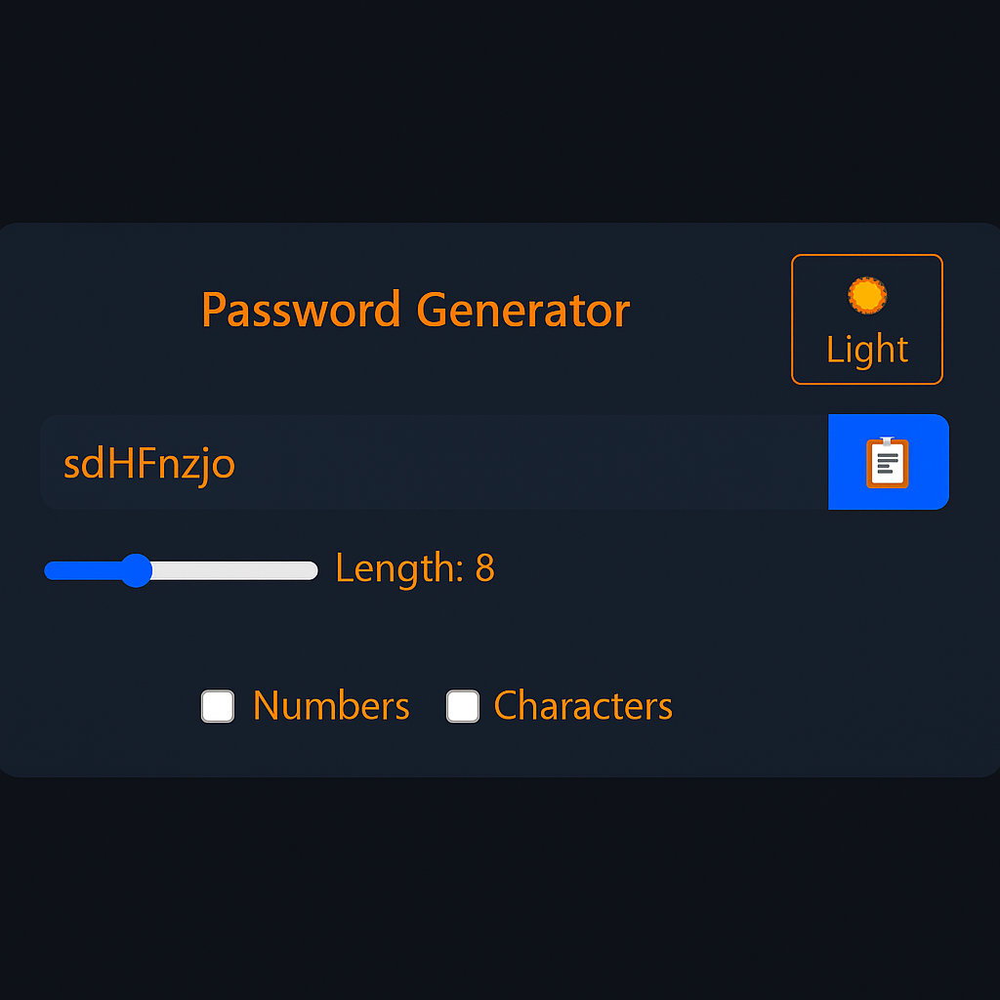

# 🔐 Password Generator App

A sleek, responsive password generator built with **React.js**. Users can generate strong, customizable passwords and copy them with a single click. Includes support for numbers and special characters with a clean dark/light toggle interface.

## 🚀 Features

- Real-time password generation
- Option to include **numbers** and **special characters**
- Adjustable password **length** (6–15)
- Copy password to clipboard with a single click
- Smooth, minimal UI with **dark and light modes**

## 🛠 Tech Stack

- **React.js** (with Hooks)
- **Tailwind CSS** (for styling)

## 📸 Preview



## 📦 Installation

```bash
git clone https://github.com/yourusername/password-generator.git
cd password-generator
npm install
npm start
